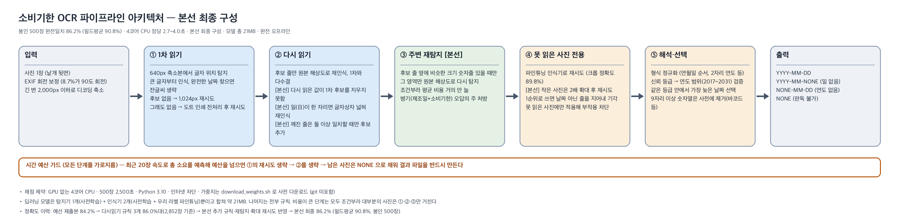

# 소비기한 OCR 파이프라인

> 상품 뒷면 사진에서 소비기한 날짜를 읽어 `YYYY-MM-DD` 로 내는 추론 파이프라인.
> 제3회 ITDA 연합학술제 본선 출품작 · 팀 [CODE]_서브웨이 (5인, 2026.09 ~ 10)



| 항목 | 예선 제출본 | 본선 최종 구성 |
| :-- | --: | --: |
| 봉인 500장 · 연·월·일 전부 일치 | 84.2% | **86.2%** |
| 봉인 500장 · 연·월·일 따로 채점 | 88.8% | **90.8%** |
| 판정용 2,852장 | 82.3% | **86.7%** |
| 제조일·소비기한 병기 (판정용 299장) | 64.9% | **78.3%** |
| CPU 속도 (4스레드, 장당) | 3.2초 | 2.7 ~ 4.0초 |
| 모델 크기 · 학습 비용 | | 약 21MB · 0원 (무료 Colab T4) |

제약은 **4코어 CPU · 인터넷 차단 · 500장 2,500초**였습니다. 시간을 넘기면 결과 파일이 없어 정확도까지 0점이 되므로, 정확도와 함께 "끝까지 완주하는 것"이 설계 조건이었습니다.

---

## 1. 무엇이 어려운 문제였나

- **포장에는 날짜가 아닌 숫자가 더 많습니다.** 품목보고번호 `20130628332176` 의 앞 8자리는 완벽한 `YYYYMMDD` 입니다. 바코드, 로트 번호, 영양성분표도 날짜처럼 읽힙니다.
- **제조일과 소비기한이 함께 찍힙니다.** 제공 데이터의 10%가 병기였고, 두 줄이 한 상자로 탐지되면 둘 중 하나만 남습니다.
- **도트 인쇄 · 각인 · 저해상도.** 데이터의 33%가 긴 변 700px 이하였고, 오답 대부분이 이 세 무리에서 나왔습니다.
- **표기 형식이 제각각입니다.** `26.06.25` 는 년/월/일일 수도 일/월/년일 수도 있습니다. 연도가 없는 제품(`10.14 09:45`)의 정답은 `NONE-10-14` 입니다.
- **채점 서버의 속도를 모릅니다.** 개발 PC에서 여유가 있어도 서버가 느리면 0점입니다.

## 2. 어떻게 풀었나

```
사진
 ├─ ① 1차 읽기 (640px)   글자 위치 탐지 → 큰 글자부터 인식. 완전한 날짜를 찾으면 잔글씨 생략
 │      └ 후보 없음 → 1,024px 재시도 → 도트 인쇄 전처리 후 재시도
 ├─ ② 주변 재탐지        후보 줄 옆에 크기 비슷한 숫자 줄이 있을 때만 원본 해상도로 다시 탐지
 ├─ ③ 다시 읽기          후보 줄만 원본 해상도로 재인식 → 1차 결과와 다수결
 ├─ ④ 못 읽은 사진 전용   파인튜닝 인식기로 재시도, 작은 사진은 2배 확대
 ├─ ⑤ 해석·선택          형식 정규화 → 신뢰 등급 → 연도 범위 → 가장 늦은 날짜
 ├─ 시간 예산 가드        예상 소요가 예산을 넘으면 재시도 단계를 줄임
 └─ 출력  YYYY-MM-DD / YYYY-MM-NONE / NONE-MM-DD / NONE
```

모델은 PaddleOCR PP-OCRv5 mobile 탐지기 1개와 인식기 2개뿐이고, 나머지는 규칙입니다.

- **비싼 연산은 필요한 사진에만 씁니다.** 재시도는 전부 조건부라 사진의 88%는 재시도 없이 장당 1.8초에 끝납니다. 재시도까지 간 12%가 전체 시간의 절반을 씁니다.
- **경량 모델로 바꾸자 속도와 정확도가 함께 풀렸습니다.** EasyOCR 구성은 장당 5.8초로 한도를 넘었고 정확도 39.1%였습니다. PP-OCRv5 mobile 로 바꾸니 1.8초, 67.7%가 됐습니다(초기 라벨 133장).
- **긴 숫자열은 파싱 전에 지웁니다.** 9자리 이상 연속 숫자는 날짜가 아닙니다.
- **후보가 없으면 `NONE` 이라고 답합니다.** 자주 나오는 날짜를 찍지 않습니다. 못 읽은 것은 사람이 입력하면 되지만, 틀린 날짜는 잘못된 정보로 남습니다.
- **시간 예산 가드.** 최근 20장 속도로 총 소요를 예측하고, 예산을 넘을 것 같으면 재시도를 줄여서라도 500장 결과를 전부 만듭니다.

날짜 해석 규칙의 정본은 [`docs/날짜_해석_규칙.md`](docs/날짜_해석_규칙.md)이고, 라벨링 도구와 파이프라인이 같은 규칙을 쓰는지 실행 때마다 자가검증합니다.

## 3. 어떻게 쟀나

| 데이터 | 수량 | 용도 |
| :-- | --: | :-- |
| 봉인 측정용 | 500장 | 최종 수치 전용. 본선의 규칙 도출·학습·채택 판정에 쓰지 않음 |
| 판정·학습용 | 2,852장 | 개선안 채택 판정, 인식기 학습용 글자 조각 추출 |
| 직접 촬영 | 389장 | 팀원이 폰으로 찍은 어려운 유형. 학습에 쓰지 않고 시험지로 사용 |

- 제공 데이터 3,352장을 팀이 전부 직접 라벨링했습니다. 정답 기준은 `final_date` 완전 일치이고 `NONE` 도 정답 값입니다.
- **새로 맞힌 장(회복)과 새로 틀린 장(퇴보)을 따로 셉니다.** 퇴보가 회복의 1/3을 넘으면 점수가 올라도 기각했습니다. 실험 하나는 환경변수 플래그 하나(기본 꺼짐)와 [`docs/실험_기록.md`](docs/실험_기록.md) 한 줄로 남깁니다.
- 300장 기준 ±1%p는 잡음(표준오차 약 2.6%p)이라 채택 근거로 쓰지 않았습니다.
- **정답 라벨도 검증했습니다.** 오답 446장을 사람이 다시 보니 라벨 오류가 16장이었고, 그중 11장은 모델이 맞고 사람이 틀린 것이었습니다.

## 4. 오답을 "정답이 사라진 단계"로 진단

예선 구성의 오답 603장을 단계별로 나눠, 단계마다 처방을 따로 세웠습니다.

| 정답이 사라진 단계 | 장수 | 처방 | 결과 (회복/퇴보) |
| :-- | --: | :-- | :-- |
| 선택 실패: 후보에 정답이 있는데 다른 것을 고름 | 19 | 구분자 일치 규칙 | +10 / −0 |
| 다시 읽기가 맞던 답을 덮어씀 | 111 | 1차 후보를 지우지 못하게 함 | +53 / −5 |
| 오독: 숫자를 잘못 읽음 | 290 | 글자 상자 넓히기, 해석 규칙, 깨진 줄 다시 읽기 | +36 / −2 |
| 미검출: 후보가 없음 | 183 | 주변 재탐지, 작은 사진 확대, 파인튜닝 재시도 | +25 / −1 |

판정용 2,852장에서의 단계별 효과: 예선 구성 82.3% → 다시 읽기 규칙 84.3% → 한국어 인식기 2차 의견 84.7% → 해석 규칙 4개 86.0% → 주변 재탐지·확대 재시도·파인튜닝 재시도 86.9% → 시간 여유를 위해 한국어 인식기를 끈 최종 구성 86.7%.

### 기각한 것

| 시도 | 결과 | 기각 이유 |
| :-- | :-- | :-- |
| 파인튜닝 인식기를 1순위로 | +38 / −27 | 점수는 올라도 맞던 답을 흔듦. 못 읽은 사진에만 쓰면 +7 / −0 |
| 파인튜닝 인식기를 다시 읽기에 | +86 / −64 | 같은 이유 |
| 인식기 셋 다수결 | +8 / −4, 장당 +0.43초 | 퇴보 비율과 시간 |
| 합성 도트 글자 3,000장 추가 학습 | 정밀도 84 → 81% | 정밀도 하락 |
| 해상도 일괄 상향 (5개 구성) | 전부 ±1%p, 시간 +30 ~ 50% | 잡음 범위 |
| 주변 재탐지를 모든 사진에 | 장당 6.2초 | 조건부로 바꿔 병기 +5 / −1 |
| 한국어 인식기로 한 번 더 읽기 | 봉인 500장 변화 0, 장당 +0.7초 | 시간 여유를 택해 기본 끔 |
| 어두운 사진 밝기 보정 | 퇴보가 더 많음 | 촬영 단계에서 막아야 함 |

## 5. 남은 한계

- **기본 설정으로 새 환경에서 돌리면 81.4%가 나왔습니다.** 10/2 재현에서 앞 86장이 느려 시간 가드가 발동했고, 재시도를 줄인 채 1,340초에 끝났습니다. 가드를 끄면 1,599초에 86.2%입니다. 완주를 보장하는 대가가 최대 −4.8%p라는 뜻이고, 가드 예산(2,000초)이 보수적이었습니다. 기록은 [`제출/재현_2026-10-02/`](제출/재현_2026-10-02/README.md).
- **봉인 500장이 완전히 깨끗하지는 않습니다.** 예선 때는 이 500장으로 채택 판정을 했고, 오답을 보고 라벨 7장을 고쳤습니다. 본선 판정은 전부 나머지 2,852장에서 했습니다.
- **실제 폰 사진에서는 훨씬 낮습니다.** 직접 찍은 389장은 완전일치 52.4%, 미인식 21.9%입니다. 어려운 유형을 골라 찍은 것이라 평균은 아니지만, 배포 데이터와 실사용 사이의 간격을 보여 줍니다.
- **각인과 저해상도는 규칙으로 닿지 않습니다.** 각인은 대부분 못 읽고, 저해상도는 83.7%입니다. 인식기 학습 데이터가 더 필요합니다.
- **채점 서버 속도는 실측하지 못했습니다.** 개발 PC 두 대 기준 한도의 55 ~ 79%입니다.
- **맥 환경 재현이 어긋났습니다.** 9/30 맥 재현은 69.4%(미인식 121장)였고, 같은 사진을 Windows에서 돌리면 공식 예측과 같았습니다. 원인은 확인하지 못했습니다.

## 6. 도메인 기획

중고거래 플랫폼에서 판매자가 식품의 날짜면을 찍으면, **확신할 때만** 소비기한 칸을 채우고 판매자가 확인하게 하는 기능으로 기획했습니다. 못 읽으면 빈칸이고 틀리게 읽으면 판매자가 고칩니다. 이 조건에서 정확도는 안전성이 아니라 자동 입력 비율을 정합니다(폰 사진 기준 41 ~ 45%). 운영 구조, 비용, 한계는 [`제출/`](제출/)의 본선 보고서에 있습니다.

## 7. 팀과 역할

| 담당 | 범위 |
| :-- | :-- |
| **탐지·후보 생성 · 통합 · 제출 (본인)** | 시간 예산 가드, 주변 재탐지(v1 ~ v7), 작은 사진 확대 재시도, 인식기 파인튜닝(Colab), 평가·비교 스크립트(`eval.py` · `compare.py`), 라벨링 도구, 브랜치 통합과 재현 검증 |
| 인식·해석 규칙 | PP-OCRv5 파이프라인 전환, 다시 읽기 다수결, 후처리 규칙, 오답 단계 진단 |
| 도메인 · 보고서 · 발표 (3인) | 적용 도메인 조사와 기획, 본선 보고서, 발표 자료 |

라벨링은 5명이 블록 단위로 나눠 했습니다. 개발 과정에서 코딩 어시스턴트(Claude Code)를 실험 실행과 기록에 활용했고, 문제 정의와 채택·기각 판단은 팀이 했습니다.

## 8. 실행

Python 3.10 기준입니다(3.11 동작 확인).

```bash
git clone https://github.com/LEEbyeongchul/itda3-CODE-subway.git
cd itda3-CODE-subway
python -m venv .venv && source .venv/bin/activate   # Windows Git Bash: source .venv/Scripts/activate
pip install -r requirements.txt
bash download_weights.sh                            # 가중치를 weights/ 에 받음 (오프라인 실행의 전제)

export ITDA_INPUT_DIR=./val_images
export ITDA_OUTPUT_PATH=./submission.csv
jupyter nbconvert --to notebook --execute predict.ipynb --output /tmp/executed.ipynb
```

- 출력 `submission.csv` 의 열은 `image_id, year, month, day, final_date` 입니다. 각 필드는 따로 `NONE` 이 될 수 있습니다.
- `ITDA_DEBUG=1` 을 주면 장마다 소요 시간, 모든 날짜 후보, 최종 선택을 출력합니다.
- `ITDA_TIME_BUDGET` 으로 시간 가드 예산(기본 2,000초)을 바꿉니다. 측정 실행은 `100000` 으로 가드를 껐습니다.
- 대회 제공 이미지는 저장소에 없습니다. 팀이 붙인 라벨은 `labels/` 와 `custom_data/` 에 있습니다.
- 환경별 문제 해결과 파라미터 설명은 [`docs/예선_제출_README.md`](docs/예선_제출_README.md)에 남겨 두었습니다(예선 시점 기준).

## 9. 저장소 구성

| 경로 | 내용 |
| :-- | :-- |
| `predict.ipynb` | 추론 노트북 (대회 채점 대상) |
| `download_weights.sh` | 가중치 사전 다운로드 |
| `notebooks/` | 평가(`eval.py`) · 버전 비교(`compare.py`) · 오답 진단 · 실험 스크립트 · 파인튜닝 |
| `labels/` · `custom_data/` | 직접 라벨링 3,352장과 직접 촬영 389장의 라벨, 라벨링 도구 |
| `results/` | 실험별 예측·디버그 출력 |
| `docs/` | 실험 기록, 날짜 해석 규칙, 기술 설명, 대회 안내서, 기획 문서 |
| `제출/` | 본선 보고서, 새 가상환경 재현 로그, 제출 커밋 해시 |
| `.github/workflows/smoke.yml` | Ubuntu · Python 3.10 · 오프라인 조건의 스모크 테스트 |

대회 제출 커밋은 [`제출/커밋해시.txt`](제출/커밋해시.txt)에 있습니다. 이 README는 제출 이후 포트폴리오용으로 다시 쓴 것이고 추론 코드는 바꾸지 않았습니다.
